# 2. High Level Architecture

### 2.1 Technical Summary

O ERPsb utiliza uma arquitetura **monolito modular (DDD)** deployada como uma aplicacao **Next.js 15** na **Vercel**, com **PostgreSQL 16** via **Supabase** como banco de dados. A separacao de dominios e feita em modulos isolados dentro do mesmo repositorio, comunicando-se via eventos internos. O frontend usa **React Server Components** para performance otima, com **Tailwind CSS 4** e **shadcn/ui** para UI consistente. A autenticacao via **NextAuth.js v5** com Google OAuth e multi-tenant via **Row-Level Security (RLS)** garantem isolamento total de dados. Integracoes externas (Focus NFe, Mercado Pago, WhatsApp) sao processadas de forma assincrona via **BullMQ + Upstash Redis**, garantindo resiliencia com circuit breakers e filas de retry. Esta arquitetura atinge os objetivos do PRD de simplicidade radical, performance mobile-first (FCP < 1.5s) e custo infra baixo (free tiers).

### 2.2 Platform and Infrastructure

**Platform:** Vercel + Supabase
**Key Services:**
- Vercel: Frontend SSR/SSG, API Routes (serverless functions), Edge Middleware, Preview Deploys
- Supabase: PostgreSQL 16 (database + RLS), Auth (backup), Storage (certificados digitais, XMLs fiscais), Realtime (notificacoes)
- Upstash: Redis serverless (BullMQ queues, rate limiting, cache)

**Deployment Regions:** GRU (Sao Paulo) - latencia minima para usuarios brasileiros

**Justificativa:** Vercel + Supabase oferece o melhor custo-beneficio para um MVP com time pequeno: free tiers generosos, deploy zero-config para Next.js, PostgreSQL managed com RLS nativo, e storage integrado. Escala automaticamente ate milhares de usuarios sem mudanca de arquitetura.

### 2.3 Repository Structure

**Structure:** Monorepo simples (Next.js App Router)
**Monorepo Tool:** N/A - repositorio unico sem workspace tools (sem Turborepo/Nx no MVP)
**Package Manager:** pnpm

O Next.js App Router unifica frontend e backend no mesmo projeto. A separacao ocorre via estrutura de pastas DDD, nao via packages separados. Shared types e utils vivem em `src/lib/`.

### 2.4 High Level Architecture Diagram

```mermaid
graph TB
    subgraph Users["Usuarios"]
        Mobile["📱 PWA Mobile<br/>(Android/iOS)"]
        Desktop["💻 Desktop<br/>(Chrome/Safari/Firefox)"]
    end

    subgraph Vercel["Vercel (GRU)"]
        Edge["Edge Middleware<br/>(Auth + Rate Limit + Tenant)"]
        NextApp["Next.js 15 App"]

        subgraph Frontend["Frontend (RSC + Client)"]
            Pages["App Router Pages"]
            Components["shadcn/ui Components"]
            PWA["Service Worker + Cache"]
        end

        subgraph API["API Routes"]
            AuthAPI["Auth API<br/>(NextAuth.js v5)"]
            CrudAPI["CRUD APIs<br/>(Cadastros/Financeiro/Vendas)"]
            WebhookAPI["Webhook APIs<br/>(PIX/WhatsApp)"]
        end
    end

    subgraph Supabase["Supabase (GRU)"]
        PG["PostgreSQL 16<br/>(RLS Multi-tenant)"]
        Storage["Supabase Storage<br/>(XMLs, Certificados)"]
    end

    subgraph Upstash["Upstash Redis"]
        Queue["BullMQ Queues<br/>(NFe, WhatsApp, PIX)"]
        RateLimit["Rate Limiter"]
        Cache["Cache Layer"]
    end

    subgraph External["Integracoes Externas"]
        FocusNFe["Focus NFe API<br/>(NFe/NFSe/NFCe)"]
        MercadoPago["Mercado Pago API<br/>(PIX/Pagamentos)"]
        WhatsApp["WhatsApp Business API<br/>(Mensagens)"]
        Google["Google OAuth<br/>(Autenticacao)"]
    end

    subgraph Monitoring["Observabilidade"]
        Sentry["Sentry<br/>(Erros)"]
        PostHog["PostHog<br/>(Analytics)"]
    end

    Mobile --> Edge
    Desktop --> Edge
    Edge --> NextApp
    NextApp --> Frontend
    NextApp --> API
    API --> PG
    API --> Storage
    API --> Queue
    API --> RateLimit
    Queue --> FocusNFe
    Queue --> MercadoPago
    Queue --> WhatsApp
    AuthAPI --> Google
    WebhookAPI --> Queue
    MercadoPago -.->|webhook| WebhookAPI
    WhatsApp -.->|webhook| WebhookAPI
    NextApp --> Sentry
    NextApp --> PostHog
    Edge --> Cache
```

### 2.5 Architectural Patterns

- **Monolito Modular (DDD):** Modulos isolados por dominio de negocio (cadastros, financeiro, vendas, fiscal, estoque) com interfaces claras entre si. Permite extrair modulos para microservicos no futuro sem retrabalho. _Rationale:_ Time pequeno (2-3 devs), complexidade de microservicos injustificada para MVP.

- **React Server Components (RSC):** Renderizacao server-side por padrao, client components apenas quando interatividade e necessaria. _Rationale:_ Performance superior (menor JS bundle), FCP < 1.5s, SEO built-in, data fetching simplificado.

- **Repository Pattern:** Camada de acesso a dados abstraida via Prisma com extensoes de tenant filtering. _Rationale:_ Isolamento de queries, facilita testes unitarios, centraliza logica de multi-tenant.

- **Event-Driven (interno):** Modulos comunicam-se via EventEmitter para operacoes cross-domain (ex: venda confirmada → financeiro + estoque). _Rationale:_ Desacoplamento entre modulos sem overhead de message broker externo.

- **Circuit Breaker + Queue:** Integracoes externas usam BullMQ com retry exponencial e circuit breaker. _Rationale:_ NFR15/NFR16 exigem resiliencia; Focus NFe/Mercado Pago fora do ar nao deve travar o sistema.

- **Progressive Disclosure (UI):** Formularios comecam com campos minimos e expandem sob demanda. _Rationale:_ Diferencial do ERPsb - simplicidade radical para usuarios que nunca usaram ERP.

- **Mobile-First Responsive:** Design primariamente para 320px-428px, adaptando para desktop via breakpoints. _Rationale:_ 70%+ dos usuarios-alvo acessam pelo celular.

---

