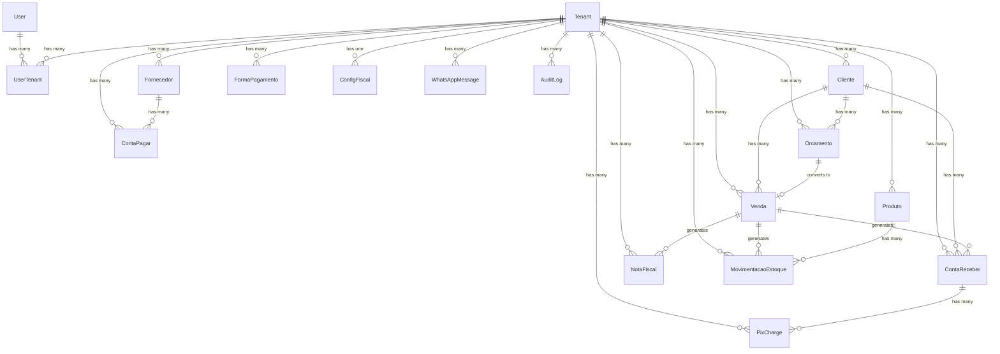

# 4. Data Models

### 4.1 Entity Relationship Overview



### 4.2 Core Models

#### User

**Purpose:** Conta de usuario do sistema (pode pertencer a multiplos tenants)

```typescript
interface User {
  id: string;              // cuid
  email: string;           // unique
  name: string;
  image?: string;          // avatar URL (Google)
  provider: 'google' | 'credentials';
  passwordHash?: string;   // only for credentials provider
  createdAt: Date;
  updatedAt: Date;
}
```

#### Tenant

**Purpose:** Empresa/negocio do usuario (unidade de isolamento multi-tenant)

```typescript
interface Tenant {
  id: string;              // cuid
  name: string;
  document?: string;       // CNPJ or CPF (optional for informal)
  type: 'MEI' | 'ME' | 'EPP' | 'INFORMAL';
  plan: 'FREE' | 'STARTER' | 'GROWTH' | 'PRO';
  businessType?: string;   // servicos, comercio, alimentacao, beleza, outro
  monthlyRevenue?: string; // faixa de faturamento
  onboardingCompleted: boolean;
  address?: JsonValue;     // {street, number, complement, neighborhood, city, state, zip}
  phone?: string;
  email?: string;
  logo?: string;           // URL Supabase Storage
  createdAt: Date;
  updatedAt: Date;
}
```

#### UserTenant

**Purpose:** Relacao N:N entre User e Tenant com role

```typescript
interface UserTenant {
  id: string;
  userId: string;
  tenantId: string;
  role: 'OWNER' | 'ADMIN' | 'USER';
  isActive: boolean;       // tenant atualmente selecionado
  createdAt: Date;
}
```

#### Cliente

**Purpose:** Cliente do negocio (cadastro progressivo)

```typescript
interface Cliente {
  id: string;
  tenantId: string;
  name: string;            // obrigatorio
  phone: string;           // obrigatorio
  email?: string;
  document?: string;       // CPF or CNPJ
  address?: JsonValue;
  notes?: string;
  createdAt: Date;
  updatedAt: Date;
}
```

#### Fornecedor

**Purpose:** Fornecedor do negocio

```typescript
interface Fornecedor {
  id: string;
  tenantId: string;
  name: string;
  phone?: string;
  email?: string;
  document?: string;
  address?: JsonValue;
  notes?: string;
  createdAt: Date;
  updatedAt: Date;
}
```

#### Produto

**Purpose:** Produto ou servico comercializado

```typescript
interface Produto {
  id: string;
  tenantId: string;
  type: 'PRODUTO' | 'SERVICO';
  name: string;
  sellPrice: number;       // centavos
  costPrice?: number;      // centavos
  unit: string;            // un, kg, hr, srv, m, m2, etc
  barcode?: string;
  ncm?: string;            // Nomenclatura Comum do Mercosul
  description?: string;
  stockMin?: number;
  trackStock: boolean;
  active: boolean;
  createdAt: Date;
  updatedAt: Date;
}
```

#### FormaPagamento

**Purpose:** Formas de pagamento configuradas pelo tenant

```typescript
interface FormaPagamento {
  id: string;
  tenantId: string;
  name: string;
  type: 'PIX' | 'DINHEIRO' | 'DEBITO' | 'CREDITO' | 'BOLETO' | 'OUTRO';
  active: boolean;
  isDefault: boolean;
  installments: number;    // max parcelas (1 = a vista)
  fee: number;             // taxa percentual (centesimos: 250 = 2.50%)
  createdAt: Date;
}
```

#### ContaPagar

**Purpose:** Registro de contas a pagar

```typescript
interface ContaPagar {
  id: string;
  tenantId: string;
  description: string;
  amount: number;          // centavos
  dueDate: Date;
  paidDate?: Date;
  status: 'PENDENTE' | 'PAGO' | 'VENCIDO' | 'CANCELADO';
  category: string;
  supplierId?: string;
  notes?: string;
  recurrent: boolean;
  recurrenceType?: 'MENSAL' | 'SEMANAL' | 'QUINZENAL';
  createdAt: Date;
  updatedAt: Date;
}
```

#### ContaReceber

**Purpose:** Registro de contas a receber

```typescript
interface ContaReceber {
  id: string;
  tenantId: string;
  description: string;
  amount: number;          // centavos
  dueDate: Date;
  receivedDate?: Date;
  status: 'PENDENTE' | 'RECEBIDO' | 'VENCIDO' | 'CANCELADO';
  category: string;
  clientId?: string;
  saleId?: string;
  notes?: string;
  createdAt: Date;
  updatedAt: Date;
}
```

#### Venda

**Purpose:** Registro de vendas

```typescript
interface VendaItem {
  productId: string;
  name: string;
  quantity: number;
  unitPrice: number;       // centavos
  total: number;           // centavos
}

interface Venda {
  id: string;
  tenantId: string;
  clientId?: string;
  items: VendaItem[];      // JSONB
  subtotal: number;        // centavos
  discount: number;        // centavos
  total: number;           // centavos
  paymentMethodId: string;
  status: 'RASCUNHO' | 'CONFIRMADA' | 'CANCELADA';
  notes?: string;
  createdAt: Date;
  updatedAt: Date;
}
```

#### Orcamento

**Purpose:** Registro de orcamentos

```typescript
interface Orcamento {
  id: string;
  tenantId: string;
  clientId?: string;
  items: VendaItem[];      // JSONB (mesmo formato de Venda)
  subtotal: number;
  discount: number;
  total: number;
  validUntil: Date;
  status: 'PENDENTE' | 'APROVADO' | 'RECUSADO' | 'CONVERTIDO' | 'EXPIRADO';
  notes?: string;
  saleId?: string;         // FK quando convertido
  createdAt: Date;
  updatedAt: Date;
}
```

#### PixCharge

**Purpose:** Cobranca PIX via Mercado Pago

```typescript
interface PixCharge {
  id: string;
  tenantId: string;
  contaReceberId: string;
  externalId: string;      // ID Mercado Pago
  amount: number;          // centavos
  qrCode: string;          // base64 da imagem
  qrCodeText: string;      // copia-e-cola
  paymentLink: string;
  status: 'PENDING' | 'PAID' | 'EXPIRED' | 'CANCELLED';
  expiresAt: Date;
  paidAt?: Date;
  createdAt: Date;
}
```

#### NotaFiscal

**Purpose:** Documento fiscal emitido

```typescript
interface NotaFiscal {
  id: string;
  tenantId: string;
  type: 'NFE' | 'NFSE' | 'NFCE';
  saleId: string;
  numero?: number;
  serie?: string;
  chaveAcesso?: string;
  xmlUrl?: string;         // Supabase Storage
  pdfUrl?: string;
  status: 'PROCESSANDO' | 'AUTORIZADA' | 'REJEITADA' | 'CANCELADA';
  focusNfeId?: string;
  errorMessage?: string;
  emitidaEm?: Date;
  createdAt: Date;
}
```

#### ConfigFiscal

**Purpose:** Configuracao fiscal do tenant

```typescript
interface ConfigFiscal {
  id: string;
  tenantId: string;        // unique
  regimeTributario: 'MEI' | 'SIMPLES_NACIONAL' | 'LUCRO_PRESUMIDO' | 'LUCRO_REAL';
  inscricaoEstadual?: string;
  inscricaoMunicipal?: string;
  certificateFileUrl?: string;
  certificatePassword?: string;  // encrypted
  certificateExpiry?: Date;
  ambiente: 'HOMOLOGACAO' | 'PRODUCAO';
  serieNFe: number;
  serieNFSe: number;
  serieNFCe: number;
  ultimoNumeroNFe: number;
  ultimoNumeroNFSe: number;
  ultimoNumeroNFCe: number;
  createdAt: Date;
  updatedAt: Date;
}
```

#### MovimentacaoEstoque

**Purpose:** Movimentacao de estoque

```typescript
interface MovimentacaoEstoque {
  id: string;
  tenantId: string;
  productId: string;
  type: 'ENTRADA' | 'SAIDA' | 'AJUSTE';
  quantity: number;
  reason: 'COMPRA' | 'VENDA' | 'AJUSTE_MANUAL';
  referenceId?: string;    // saleId, etc
  notes?: string;
  createdAt: Date;
}
```

#### WhatsAppMessage

**Purpose:** Registro de mensagens WhatsApp enviadas

```typescript
interface WhatsAppMessage {
  id: string;
  tenantId: string;
  clientId?: string;
  phone: string;
  type: 'COBRANCA' | 'NFE' | 'LEMBRETE' | 'ORCAMENTO';
  templateId: string;
  status: 'QUEUED' | 'SENT' | 'DELIVERED' | 'READ' | 'FAILED';
  externalId?: string;
  errorMessage?: string;
  sentAt?: Date;
  createdAt: Date;
}
```

#### AuditLog

**Purpose:** Log de auditoria para LGPD e seguranca

```typescript
interface AuditLog {
  id: string;
  tenantId: string;
  userId: string;
  action: string;          // 'CREATE' | 'UPDATE' | 'DELETE' | 'LOGIN' | 'EXPORT' etc
  entity: string;          // nome da tabela
  entityId?: string;
  changes?: JsonValue;     // {field: {old, new}}
  ipAddress?: string;
  userAgent?: string;
  createdAt: Date;
}
```

---

