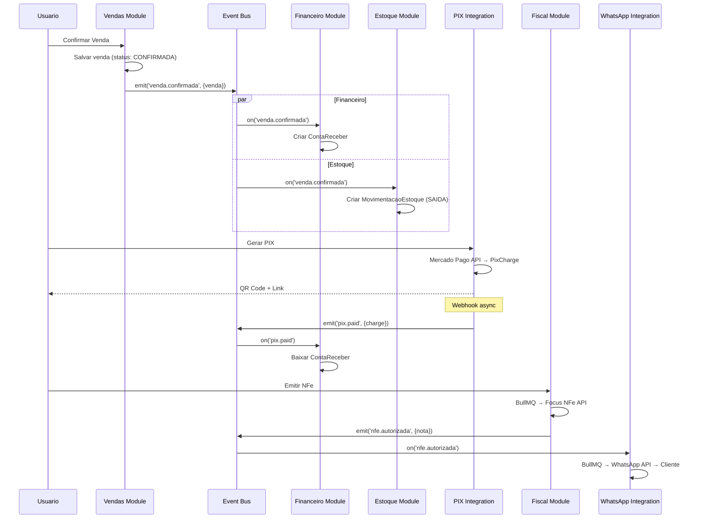

# 6. Components

### 6.1 Core Components

#### Auth Module (`src/core/auth/`)
**Responsibility:** Autenticacao, sessoes, middleware de protecao de rotas
**Key Interfaces:** `getCurrentUser()`, `requireAuth()`, `authMiddleware`
**Dependencies:** NextAuth.js, Prisma (User model)
**Technology:** NextAuth.js v5, JWT, Google OAuth

#### Tenant Module (`src/core/tenant/`)
**Responsibility:** Gestao multi-tenant, RLS, planos e limites
**Key Interfaces:** `getCurrentTenant()`, `tenantMiddleware`, `checkPlanLimit()`
**Dependencies:** Prisma (Tenant, UserTenant), Auth Module
**Technology:** Prisma Client Extension (auto tenant_id filter), PostgreSQL RLS

#### Event Bus (`src/core/events/`)
**Responsibility:** Comunicacao entre modulos via eventos internos
**Key Interfaces:** `emit(event, payload)`, `on(event, handler)`
**Dependencies:** Nenhuma externa
**Technology:** Node.js EventEmitter (sync para MVP, migravel para Redis Pub/Sub)

### 6.2 Domain Modules

#### Cadastros Module (`src/modules/cadastros/`)
**Responsibility:** CRUD de Clientes, Fornecedores, Produtos, Formas de Pagamento
**Key Interfaces:** `clienteService`, `fornecedorService`, `produtoService`, `formaPagamentoService`
**Dependencies:** Tenant Module, Prisma
**Events emitted:** nenhum

#### Financeiro Module (`src/modules/financeiro/`)
**Responsibility:** Contas a pagar/receber, fluxo de caixa, dashboard semaforo, alertas
**Key Interfaces:** `contaPagarService`, `contaReceberService`, `dashboardService`, `alertaService`
**Dependencies:** Tenant Module, Cadastros Module (fornecedores, clientes), Prisma
**Events consumed:** `venda.confirmada` → cria conta a receber, `pix.paid` → baixa conta a receber

#### Vendas Module (`src/modules/vendas/`)
**Responsibility:** Vendas rapidas, orcamentos, conversao orcamento→venda
**Key Interfaces:** `vendaService`, `orcamentoService`
**Dependencies:** Tenant Module, Cadastros Module (clientes, produtos), Prisma
**Events emitted:** `venda.confirmada`, `venda.cancelada`

#### Fiscal Module (`src/modules/fiscal/`)
**Responsibility:** Emissao NFe/NFSe/NFCe, config fiscal, certificado digital
**Key Interfaces:** `notaFiscalService`, `configFiscalService`
**Dependencies:** Tenant Module, Vendas Module, Focus NFe Integration, BullMQ
**Events consumed:** `venda.confirmada` (para auto-emissao NFCe quando configurado)

#### Estoque Module (`src/modules/estoque/`)
**Responsibility:** Movimentacoes de estoque, saldos, alertas de minimo
**Key Interfaces:** `estoqueService`, `movimentacaoService`
**Dependencies:** Tenant Module, Cadastros Module (produtos), Prisma
**Events consumed:** `venda.confirmada` → baixa estoque

### 6.3 Integration Components

#### PIX Integration (`src/integrations/pix/`)
**Responsibility:** Mercado Pago API - cobranca PIX, webhook, conciliacao
**Key Interfaces:** `pixService.createCharge()`, `pixService.processWebhook()`
**Dependencies:** Mercado Pago API, BullMQ, Financeiro Module
**Events emitted:** `pix.paid`, `pix.expired`

#### WhatsApp Integration (`src/integrations/whatsapp/`)
**Responsibility:** Envio de mensagens WhatsApp, lembretes automaticos
**Key Interfaces:** `whatsappService.send()`, `reminderJob`
**Dependencies:** WhatsApp Business API, BullMQ, Financeiro Module
**Events consumed:** `nfe.autorizada` → notifica cliente

#### Fiscal API Integration (`src/integrations/fiscal-api/`)
**Responsibility:** Adapter para Focus NFe API
**Key Interfaces:** `focusNfeClient.emitNFe()`, `focusNfeClient.emitNFSe()`, `focusNfeClient.emitNFCe()`
**Dependencies:** Focus NFe API, BullMQ
**Events emitted:** `nfe.autorizada`, `nfe.rejeitada`

### 6.4 Component Interaction Diagram

---

