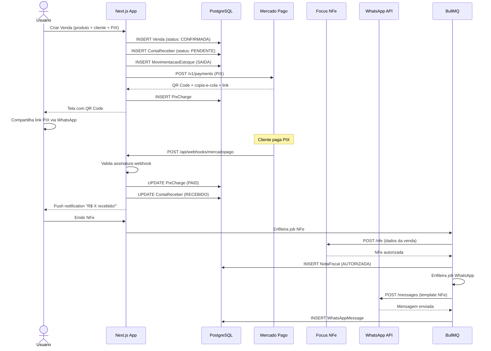
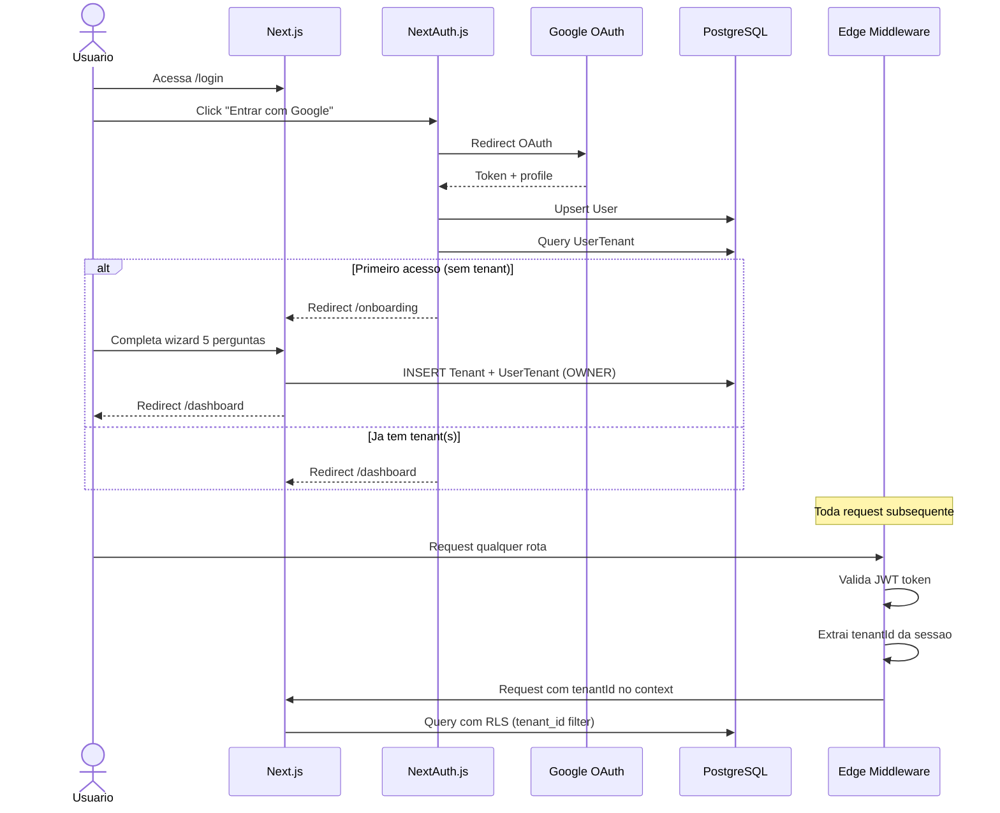

# 8. Core Workflows

### 8.1 Fluxo de Venda Completa (Venda → PIX → NFe → WhatsApp)

```mermaid
sequenceDiagram
    actor U as Usuario
    participant App as Next.js App
    participant DB as PostgreSQL
    participant MP as Mercado Pago
    participant FN as Focus NFe
    participant WA as WhatsApp API
    participant Q as BullMQ

    U->>App: Criar Venda (produto + cliente + PIX)
    App->>DB: INSERT Venda (status: CONFIRMADA)
    App->>DB: INSERT ContaReceber (status: PENDENTE)
    App->>DB: INSERT MovimentacaoEstoque (SAIDA)
    App->>MP: POST /v1/payments (PIX)
    MP-->>App: QR Code + copia-e-cola + link
    App->>DB: INSERT PixCharge
    App-->>U: Tela com QR Code

    U->>U: Compartilha link PIX via WhatsApp

    Note over MP: Cliente paga PIX
    MP->>App: POST /api/webhooks/mercadopago
    App->>App: Valida assinatura webhook
    App->>DB: UPDATE PixCharge (PAID)
    App->>DB: UPDATE ContaReceber (RECEBIDO)
    App-->>U: Push notification "R$ X recebido!"

    U->>App: Emitir NFe
    App->>Q: Enfileira job NFe
    Q->>FN: POST /nfe (dados da venda)
    FN-->>Q: NFe autorizada
    Q->>DB: INSERT NotaFiscal (AUTORIZADA)
    Q->>Q: Enfileira job WhatsApp
    Q->>WA: POST /messages (template NFe)
    WA-->>Q: Mensagem enviada
    Q->>DB: INSERT WhatsAppMessage
```

### 8.2 Fluxo de Autenticacao e Multi-Tenant

```mermaid
sequenceDiagram
    actor U as Usuario
    participant App as Next.js
    participant Auth as NextAuth.js
    participant Google as Google OAuth
    participant DB as PostgreSQL
    participant MW as Edge Middleware

    U->>App: Acessa /login
    U->>Auth: Click "Entrar com Google"
    Auth->>Google: Redirect OAuth
    Google-->>Auth: Token + profile
    Auth->>DB: Upsert User
    Auth->>DB: Query UserTenant
    alt Primeiro acesso (sem tenant)
        Auth-->>App: Redirect /onboarding
        U->>App: Completa wizard 5 perguntas
        App->>DB: INSERT Tenant + UserTenant (OWNER)
        App-->>U: Redirect /dashboard
    else Ja tem tenant(s)
        Auth-->>App: Redirect /dashboard
    end

    Note over MW: Toda request subsequente
    U->>MW: Request qualquer rota
    MW->>MW: Valida JWT token
    MW->>MW: Extrai tenantId da sessao
    MW->>App: Request com tenantId no context
    App->>DB: Query com RLS (tenant_id filter)
```

---

